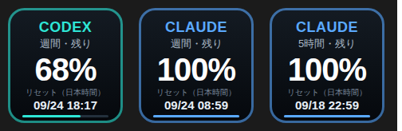

# Stream Deck AI 使用量メーター

Stream Deck のキーに **Codex / Claude の利用枠の残り％** と **リセット時刻（日本時間）** を表示するプラグインです。



左から順に「Codex 週間」「Claude 週間」「Claude 5時間」。キーを押すとその場で再取得します（通常は 60 秒ごとに自動更新）。

---

## セットアップ（1 コマンド）

Stream Deck アプリが入っている PC（macOS / Windows）で、このリポジトリを clone して実行します。

```bash
# 今使っているプロファイルの空いている行に 3 キーを追加する（おすすめ）
npm run streamdeck:install -- --apply-current

# 専用プロファイルを新規に作って取り込む
npm run streamdeck:install
```

インストーラが行うこと:

1. Stream Deck アプリを終了
2. `jp.rakutenroom.aiusage.sdPlugin` を Stream Deck の `Plugins` フォルダへコピー
3. 写真と同じ 3 キー配置のプロファイル `tools/streamdeck/dist/AI-Usage.streamDeckProfile` を生成
4. Stream Deck アプリを再起動し、生成したプロファイルを開いてインポート（確認ダイアログが出たら「インポート」）

> `--apply-current` は、既存レイアウトを崩さずに **空いている行（例: 2段目）** を自動で探して 3 キーを並べます。
> 場所を決め打ちしたいときは `--row 1`（2段目）や `--keys "codex:weekly@0,1,claude:weekly@1,1,claude:5h@2,1"` を使ってください。
>
> プロファイルのデバイス種別は、PC に既にある Stream Deck プロファイルから自動判別します。
> 判別できない場合はプラグイン導入のみ行われるので、Stream Deck の右パネル「AI Usage」カテゴリから
> **AI 使用量** アクションを 3 キーにドラッグしてください（設定内容は下表）。

### 主なオプション

| オプション | 説明 |
|---|---|
| `--apply-current` | 新規プロファイルを作らず、**今使っているプロファイルの空いている行**に直接書き込む（`manifest.json.bak-<時刻>` にバックアップを作成。使用中のキーは踏みません） |
| `--row <n>` | 配置する行を指定（0 始まり）。未指定なら、必要数ぶん連続して空いている場所を上の行から探します |
| `--col <n>` | 配置を始める列（0 始まり・既定 0） |
| `--profile "<名前>"` | 書き込む既存プロファイルを名前で指定（`--apply-current` 用。未指定ならキー数が最も多いものを選択） |
| `--keys "codex:weekly,claude:weekly,claude:5h"` | 配置するキーを指定（`codex` / `claude` × `weekly` / `5h` / `weekly_opus`）。`codex:weekly@0,1` のように `@列,行` で位置も指定できます |
| `--no-profile` | プラグイン導入だけ行う |
| `--no-restart` | Stream Deck アプリを終了・再起動しない |
| `--dry-run` | 何も書き換えず、実行内容だけ表示 |

## キーの設定項目（Property Inspector）

| 項目 | 内容 |
|---|---|
| サービス | `Codex` / `Claude` |
| 表示する枠 | `週間` / `5時間` / `週間 (Opus)`（Opus は Claude のみ） |
| 見出し | キー上部の文字（既定は `CODEX` / `CLAUDE`） |
| アクセント色 | 枠線と見出しの色（空欄なら Codex=シアン, Claude=ブルー） |
| 表記 | 日本語 / English |
| 更新間隔 | 既定 60 秒（最短 15 秒） |

設定画面下部に現在の取得結果と情報源が表示されるので、動作確認はここが早いです。

## データの取得元

| サービス | 取得方法 |
|---|---|
| **Codex** | `~/.codex/sessions/**/rollout-*.jsonl` の最新セッションから、最後に記録された `rate_limits`（`primary` = 5時間枠 / `secondary` = 週間枠）を読み取る。`CODEX_HOME` 環境変数に対応 |
| **Claude** | Claude Code のログイン情報（macOS はキーチェーン `Claude Code-credentials`、それ以外は `~/.claude/.credentials.json`）のアクセストークンで `https://api.anthropic.com/api/oauth/usage` を参照（`/usage` と同じ情報源） |

いずれも **ローカルの認証情報をその PC 内で使うだけ**で、外部へ送信するのは Anthropic の使用量 API への問い合わせのみです。

## 動作確認・トラブルシュート

```bash
node tools/streamdeck/usage-cli.mjs probe     # 取得できているか確認
node tools/streamdeck/usage-cli.mjs json      # 生データを JSON で表示
node tools/streamdeck/usage-cli.mjs preview   # キー画像のプレビュー SVG を出力
```

### うまく取得できないとき

- **Codex が「レート制限の記録が見つかりません」** … Codex CLI で 1 回会話すると記録されます。Codex を別の場所にインストールしている場合は `CODEX_HOME` を設定してください。
- **Claude が「ログイン情報が見つかりません」／HTTP 401** … `claude` を起動して `/login` し直すとトークンが更新されます。
- **キーが `--%` のまま** … Stream Deck の右クリック → 「ログを開く」でプラグインのログ（`[ai-usage] …`）を確認してください。
- **どうしても自動取得できない環境** … `~/.ai-usage-meter/override.json` を置くと、その値が最優先で表示されます（他ツールから値を流し込む用）。

  ```json
  {
    "codex":  { "weekly": { "remainingPercent": 68,  "resetAt": "2026-09-24T09:17:00Z" } },
    "claude": { "weekly": { "remainingPercent": 100, "resetAt": "2026-09-23T23:59:00Z" },
                "5h":     { "remainingPercent": 100, "resetAt": "2026-09-18T13:59:00Z" } }
  }
  ```

## アンインストール

Stream Deck を終了して、`Plugins/jp.rakutenroom.aiusage.sdPlugin` を削除してください。

- macOS: `~/Library/Application Support/com.elgato.StreamDeck/Plugins/`
- Windows: `%APPDATA%\Elgato\StreamDeck\Plugins\`

## 開発メモ

- プラグイン本体は Stream Deck 同梱の Node ランタイム（`manifest.json` の `Nodejs.Version`）で動くため、**npm 依存ゼロ**で実装しています（WebSocket クライアントも自前）。
- アイコン: `node tools/streamdeck/scripts/make-icons.mjs`
- プロファイル単体生成: `node tools/streamdeck/scripts/make-profile.mjs --out ./AI-Usage.streamDeckProfile`
- テスト: `npx tsx --test tests/streamdeck-usage.test.ts tests/streamdeck-install.test.ts`
  （前者はモックの Stream Deck サーバへ実際に WebSocket 接続する結合テスト、後者はプロファイル生成と既存プロファイルへの書き込み）
- `STREAMDECK_DATA_DIR` を設定すると Stream Deck のデータディレクトリを差し替えられます（非標準インストール／テスト用）。
